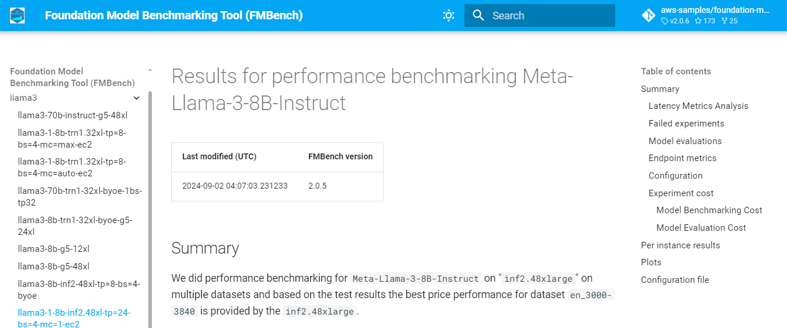

# Create a website for `FMBench` reports

When you use `FMBench` as a tool for benchmarking your foundation models you would soon want to have an easy way to view all the reports in one place and search through the results, for example, "`Llama3.1-8b` results on `trn1.32xlarge`". An `FMBench` website provides a simple way of viewing these results.

Here are the steps to setup a website using `mkdocs` and `nginx`. The steps below generate a self-signed certificate for SSL and use username and password for authentication. **It is strongly recommended that you use a valid SSL cert and a better authentication mechanism than username and password for your `FMBench` website**.

1. Start an Amazon EC2 machine which will host the `FMBench` website. A `t3.xlarge` machine with an Ubuntu AMI say `ubuntu/images/hvm-ssd-gp3/ubuntu-noble-24.04-amd64-server-20240801` and 50GB storage is good enough. **Allow SSH and TCP port 443 traffic from anywhere into that machine**.

1. SSH into that machine and install `conda`.

    ```{.bash}
    wget https://repo.anaconda.com/miniconda/Miniconda3-latest-Linux-x86_64.sh
    bash Miniconda3-latest-Linux-x86_64.sh -b  # Run the Miniconda installer in batch mode (no manual intervention)
    rm -f Miniconda3-latest-Linux-x86_64.sh    # Remove the installer script after installation
    eval "$(/home/$USER/miniconda3/bin/conda shell.bash hook)" # Initialize conda for bash shell
    conda init  # Initialize conda, adding it to the shell  
    ```

1. Install `docker-compose`.

    ```{.bash}
    sudo apt-get update
    sudo apt-get install --reinstall docker.io -y
    sudo apt-get install -y docker-compose
    sudo usermod -a -G docker $USER
    newgrp docker
    docker compose version 
    ```

1. Setup the `fmbench_python311` conda environment and clone `FMBench` repo.

    ```{.bash}
    conda create --name fmbench_python311 -y python=3.11 ipykernel
    source activate fmbench_python311
    pip install -U fmbench mkdocs mkdocs-material mknotebooks
    git clone https://github.com/aws-samples/foundation-model-benchmarking-tool.git
    ```

1. Get the `FMBench` results data from Amazon S3 or whichever storage system you used to store all the results.

    ```{.bash}
    curl "https://awscli.amazonaws.com/awscli-exe-linux-x86_64.zip" -o "awscliv2.zip"
    sudo apt-get install unzip -y
    unzip awscliv2.zip
    sudo ./aws/install
    aws s3 sync s3://fmbench_data $HOME/fmbench_data --exclude "*.json"
    ```

1. Create a directory for the `FMBench` website contents.

    ```{.bash}
    mkdir $HOME/fmbench_site
    mkdir $HOME/fmbench_site/ssl
    ```
1. Setup SSL certs (we strongly encourage you to not use self-signed certs, this step here is just for demo purposes, get SSL certs the same way you get them for your current production workloads).

    ```{.bash}
    sudo openssl req -x509 -nodes -days 365 -newkey rsa:2048 -keyout $HOME/fmbench_site/ssl/nginx-selfsigned.key -out $HOME/fmbench_site/ssl/nginx-selfsigned.crt
    ```

1. Create an `.httpasswd` file. The `FMBench` website will use the `fmbench_admin` as a username and a password that you enter as part of the command below to allow login to the website.

    ```{.bash}
    sudo apt-get install apache2-utils -y
    htpasswd -c $HOME/fmbench_site/.htpasswd fmbench_admin
    ```

1. Create the `mkdocs.yml` file for the website.

    ```{.bash}
    cd foundation-model-benchmarking-tool
    cp website/index.md $HOME/fmbench_data/
    cp -r img $HOME/fmbench_data/
    python website/create_fmbench_website.py
    mkdocs build -f website/mkdocs.yml --site-dir $HOME/fmbench_site/site
    ```

1. Update `nginx.conf` file. **Note the hostname that is printed out below, the `FMBench` website would be served at this address**.

    ```{.bash}
    TOKEN=`curl -X PUT "http://169.254.169.254/latest/api/token" -H "X-aws-ec2-metadata-token-ttl-seconds: 21600"`
    HOSTNAME=`curl -H "X-aws-ec2-metadata-token: $TOKEN" http://169.254.169.254/latest/meta-data/public-hostname`
    echo "hostname is: $HOSTNAME"
    sed "s/__HOSTNAME__/$HOSTNAME/g" website/nginx.conf.template > $HOME/fmbench_site/nginx.conf
    ```

1. Serve the website.

    ```{.bash}
    docker run --name fmbench-nginx -d -p 80:80 -p 443:443   -v $HOME/fmbench_site/site:/usr/share/nginx/html   -v $HOME/fmbench_site/nginx.conf:/etc/nginx/nginx.conf   -v $HOME/fmbench_site/ssl:/etc/nginx/ssl   -v $HOME/fmbench_site/.htpasswd:/etc/nginx/.htpasswd   nginx
    ```

1. Open a web browser and navigate to the hostname you noted in the step above, for example `https://<your-ec2-hostname>.us-west-2.compute.amazonaws.com`, ignore the security warnings if you used a self-signed SSL cert (replace this with a cert that you would normally use in your production websites) and then enter the username and password (the username would be `fmbench_admin` and password would be what you had set when running the `htpasswd` command). You should see a website as shown in the screenshot below.


